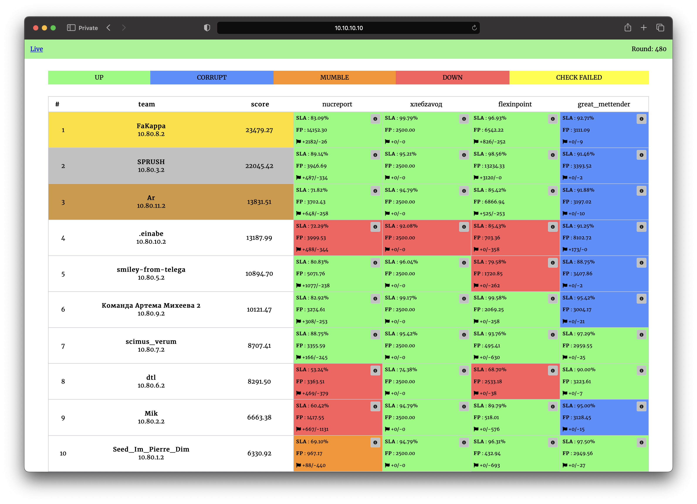

# CTF Cup 2022 Stage 2

The contest was held on December 10, 2022.

Repository contains source code of services, checkers and sploits.

## Results

[Full scoreboard](scoreboard/full.png)

## Services

| Service | Language | Checker | Sploits | Authors |
|---------|----------|---------|---------|---------|
| **[flexinpoint](services/flexinpoint/)** | C++ | [Checker](checkers/flexinpoint/) | [Sploits](sploits/flexinpoint/) | [@b1r1b1r1](https://github.com/b1r1b1r1) |
| **[great_mettender](services/great_mettender/)** | Go | [Checker](checkers/great_mettender/) | [Sploits](sploits/great_mettender/) | [@pomo-mondreganto](https://github.com/pomo-mondreganto) |
| **[nucreport](services/nucreport/)** | Rust | [Checker](checkers/nucreport/) | [Sploits](sploits/nucreport/) | [@jnovikov](https://github.com/jnovikov) |
| **[хлебzаvод](services/хлебzаvод/)** | Zig & V | [Checker](checkers/хлебzаvод/) | [Sploits](sploits/хлебzаvод/) | [@renbou](https://github.com/renbou) |

## Infrastructure

- DevOps: [@pomo_mondreganto](https://github.com/pomo-mondreganto)
- Checksystem: [ForcAD](https://github.com/pomo-mondreganto/ForcAD)
- Checksystem config: [forcad.yml](./forcad.yml)

## Writeups

- [flexinpoint](/sploits/flexinpoint/)
- [great_mettender](/sploits/great_mettender/)
- [nucreport](/sploits/nucreport/)
- [хлебzаvод](/sploits/хлебzаvод/)

